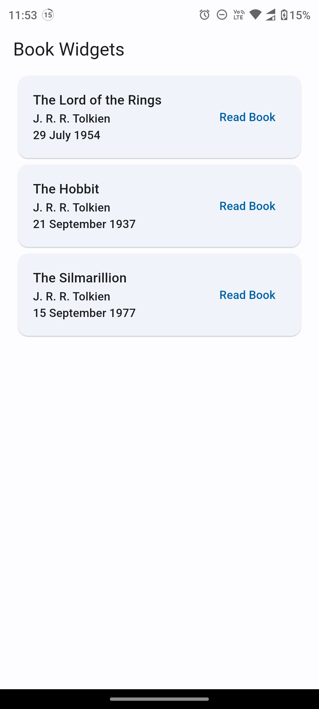

# book_widgets

**ES**:
Este proyecto es parte de la prueba tecnica como desarrollador Flutter en Accentio Studios
Esta prueba tecnica fue desarrollada con Flutter 3.13. y Dart 3.1.0

**PT**:
Este projeto faz parte do teste técnico como desenvolvedor Flutter na Accentio Studios
Este teste técnico foi desenvolvido com Flutter 3.13. e Dart 3.1.0

## Requisitos

**ES**:
En este proyecto te vas a encontrar con una aplicacion basica con dos pantallas. Una es el home donde muestra una lista de libros que vienen cargados de /assets/books.json y la otra pantalla es donde se muestra la lectura del libro.

**PT:**
Neste projeto você encontrará um aplicativo básico com duas telas. Uma é a home onde mostra uma lista de livros que são carregados de /assets/books.json e a outra tela é onde a leitura do livro é mostrada.

**ES:**
### To-do:
- [ ] La pantalla de lectura tiene un error que no permite hacer scroll. Debes arreglarlo.
- [ ] El diseño de la pantalla de lectura no es el mejor. Debes mejorar el diseño de la pantalla de lectura. Puedes usar el diseño que quieras.
- [ ] Debes mostrar los datos del libro en la pantalla de lectura. Autor, fecha de publicacion y titulo.

### Puntos extra
- [ ] Agregar un boton en la pantalla de lectura que permita agregar el libro a favoritos.
- [ ] Crear una nueva pantalla que muestre los libros favoritos y que puedas accedes a esa pantalla desde el home.
- [ ] Mostrar una barra de progreso en la pantalla de lectura que muestre el progreso de lectura del libro.

**PT:**
### To-do:
- [ ] A tela de leitura tem um erro que não permite fazer scroll. Você deve consertá-lo.
- [ ] O design da tela de leitura não é o melhor. Você deve melhorar o design da tela de leitura. Você pode usar o design que quiser.
- [ ] Você deve mostrar os dados do livro na tela de leitura. Autor, data de publicação e título.

### Ponto extra
- [ ] Adicione um botão na tela de leitura que permita adicionar o livro aos favoritos.
- [ ] Crie uma nova tela que mostre os livros favoritos e que você possa acessar essa tela a partir da home.
- [ ] Mostrar uma barra de progresso na tela de leitura que mostre o progresso da leitura do livro.

## Como entregar la prueba / Como entregar o teste
**ES:**
Debes hacer un fork de este repositorio y crear un nuevo branch con tu nombre y apellido. Despues de hacer los cambios para solucionar la prueba debes hacer un pull request a este repositorio con los cambios realizados. Debes usar Conventional Commits para los mensajes de los commits.

**PT:**
Você deve fazer um fork este repositório e criar um novo branch com seu nome e sobrenome. Após realizar as alterações para resolver o teste você deve fazer um pull request para este repositório com as alterações realizadas. Você deve usar Conventional Commits para mensagens de commit.
